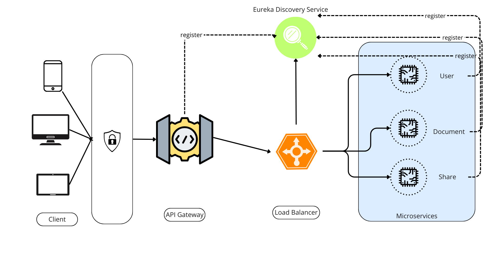
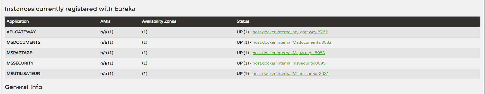

# Document Management System

## Overview
The **Document Management System** (DMS) is a microservices-based application that enables users to manage documents, share them securely with others, and control access through role-based authorization. The system's microservices are independently deployable, scalable, and discoverable via Eureka.

This project utilizes:
- **Eureka** for service discovery.
- **Spring Cloud Gateway** for routing and load balancing.
- **JWT** (JSON Web Tokens) for secure authentication and authorization.
- **Spring Security** for role-based access control.

The system includes six key microservices:
- **User Service** for user management.
- **Document Service** for document management.
- **Share Service** for sharing documents.
- **API Gateway** for routing requests.
- **Security Service** for managing authentication and authorization.
- **Eureka Server** for service discovery.

### Microservices Architecture Diagram

---

## Microservices

### 1. **User Service**
The User Service manages the system's users. It handles user registration, login, and retrieval of user details.

- **Attributes**: `Utilisateur(id, nom, email)`
- **Endpoints**:
   - `POST /users` - Register a new user.
   - `GET /users/{id}` - Get user information.

*Utility*: This service is responsible for managing user data and works closely with the Security Service to authenticate and authorize users. Each user has an associated role (e.g., Admin, Regular User) to manage permissions.

---

### 2. **Document Service**
The Document Service allows users to create, view, update, and delete documents.

- **Attributes**: `Document(id, titre, contenu, propriétaire_id)`
- **Endpoints**:
   - `POST /documents` - Create a new document.
   - `GET /documents/{id}` - Retrieve a document by ID.
   - `PUT /documents/{id}` - Update document content.
   - `DELETE /documents/{id}` - Delete a document.

*Utility*: This is the core service responsible for managing documents. It interacts with the Share Service to ensure documents are shared securely and appropriately.

---

### 3. **Share Service**
The Share Service manages sharing of documents between users, ensuring that only authorized users can access shared documents.

- **Attributes**: `Partage(id, document_id, utilisateur_id)`
- **Endpoints**:
   - `POST /shares` - Share a document with a user.
   - `GET /shares/{userId}` - List documents shared with a user.

*Utility*: This service ensures that documents can be shared securely, maintaining access control using user roles. It validates permissions through the Security Service.

---

### 4. **API Gateway**
The API Gateway routes all incoming requests to the appropriate microservice. It also provides load balancing, request validation, and security checks.

- **Endpoints**: All requests are routed through the gateway.
   - `/users/**` -> User Service
   - `/documents/**` -> Document Service
   - `/shares/**` -> Share Service

*Utility*: The gateway is responsible for routing, security token verification, and ensuring that traffic is directed to the correct service.

---

### 5. **Security Microservice**
The Security Microservice handles user authentication and authorization. It uses JWT (JSON Web Tokens) to secure communication between services and users.

- **Key Concepts**:
   - **JWT**: A compact, URL-safe token used for securely transmitting information between the user and the server. Each request to the API Gateway carries a token to verify the user's identity and permissions.
   - **Signing**: JWTs are signed using a secret key, ensuring that tokens are valid and have not been tampered with.
   - **Token Expiration**: JWTs are time-limited, preventing unauthorized access over extended periods.

*Utility*: This service ensures that only authenticated users can access system resources. It verifies tokens in every request and assigns roles to users, controlling access to different services (e.g., Admin vs Regular User).

---

### 6. **Eureka Server**
The Eureka Server provides service discovery for all microservices. Each microservice registers with the Eureka server and can discover other services dynamically, allowing for flexible and scalable architecture.

*Utility*: Eureka is crucial for the scalability and resilience of the system, enabling services to discover each other and allowing dynamic routing through the API Gateway.

---

## Features
- **Document Management**: Create, view, update, and delete documents.
- **User Management**: Register and manage users with role-based access.
- **Document Sharing**: Share documents with other users securely.
- **Authentication and Authorization**: Role-based access control using JWT tokens for secure document sharing.
- **Microservices Architecture**: Modular, scalable, and dynamic service discovery via Eureka.

---

## Technologies
- **Spring Boot**: For building microservices.
- **Eureka**: For service discovery.
- **Spring Cloud Gateway**: For routing and load balancing.
- **Spring Security**: For managing access control with JWT.
- **MySQL/PostgreSQL**: For storing user, document, and sharing data.
- **Docker** (optional): For containerized deployment.
- **Java 17**: For application development.

---

## Security Concept: JWT and Role-Based Access Control
### JSON Web Tokens (JWT)
JWTs are used to authenticate users. After a user logs in, the Security Microservice generates a JWT, which is sent back to the user and included in the headers of subsequent requests. The token contains encoded information about the user and their roles.

- **JWT Structure**: Header, Payload, Signature.
   - **Header**: Information about the token type and the signing algorithm.
   - **Payload**: Contains claims, which are statements about the user (e.g., user ID, roles).
   - **Signature**: Ensures the token has not been tampered with.

### Role-Based Access
The system uses roles (e.g., Admin, User) to control access to resources. Roles are defined in the User Service and enforced by the Security Microservice.

- **Admin**: Can create, update, delete, and share documents.
- **Regular User**: Can create and view documents but requires permission to edit or share.

---

## Getting Started

### Prerequisites
- Java 17 or later
- Maven
- Docker (optional)
- MySQL/PostgreSQL database setup

### Running the Application
1. Clone the repository.
2. Configure the MySQL/PostgreSQL database in each microservice.
3. Build the project using Maven:
    ```bash
    mvn clean install
    ```
4. Start the Eureka Server, then start each microservice.
5. Access the API Gateway at `http://localhost:8080`.

### Docker Setup (Optional)
For a containerized setup:
1. Build Docker images for each microservice.
2. Use `docker-compose` to run all containers:
    ```bash
    docker-compose up
    ```

---

## Screenshots
(Add screenshots here for each microservice running, including the Eureka dashboard, API Gateway, User, Document, Share services, and Security service.)

---

## License
This project is licensed under the MIT License - see the [LICENSE](LICENSE) file for details.
